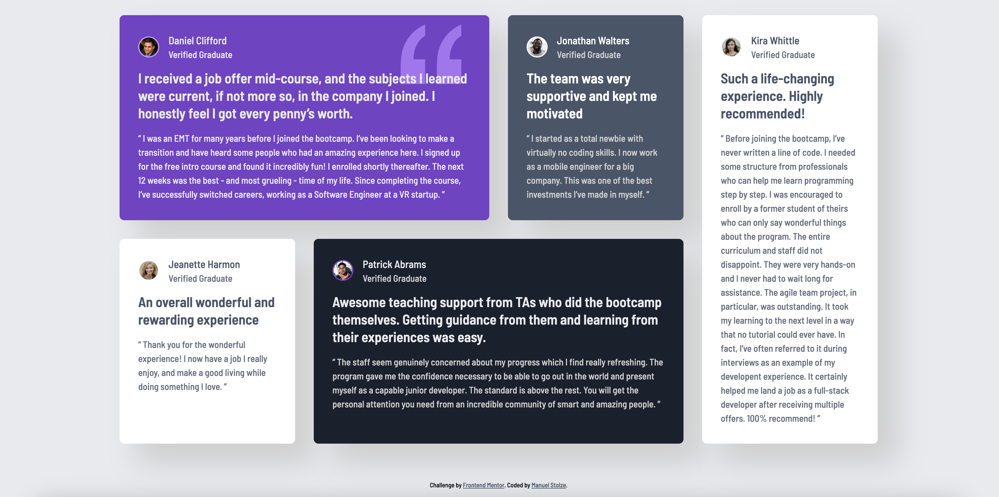

# Frontend Mentor - Testimonials grid section solution

This is a solution to the [Testimonials grid section challenge on Frontend Mentor](https://www.frontendmentor.io/challenges/testimonials-grid-section-Nnw6J7Un7). Frontend Mentor challenges help you improve your coding skills by building realistic projects. 

## Table of contents

- [Overview](#overview)
  - [The challenge](#the-challenge)
  - [Screenshot](#screenshot)
  - [Links](#links)
- [My process](#my-process)
  - [Built with](#built-with)
  - [What I learned](#what-i-learned)
  - [Useful resources](#useful-resources)
- [Author](#author)
- [Acknowledgments](#acknowledgments)

## Overview

### The challenge

Users should be able to:

- View the optimal layout for the site depending on their device's screen size

### Screenshot

### Links

- Solution URL: [Github](https://github.com/manuelstolze/testimonials-grid-section)
- Live Site URL: [Vercel](https://testimonials-grid-section-ten-beta.vercel.app/)

## My process

### Built with

- Semantic HTML5 markup
- CSS custom properties
- Flexbox
- CSS Grid
- Mobile-first workflow

### What I learned

I'm getting familiar using the CSS Grid layout. I learned how to create a grid layout with multiple rows and columns and how to place items in specific grid areas. This helped me to create a more complex layout with multiple cards and different sections.

Also, I learned more about position relative and absolute in CSS. I used it to position the quotes and the images in the testimonial cards.

### Useful resources

- [W3Schools](https://www.w3schools.com/css/css_positioning.asp) - This helped me to understand the CSS positioning. I really liked the examples and the explanations.

## Author

- Website - [Manuel Stolze](https://github.com/manuelstolze)
- Frontend Mentor - [@manuelstolze](https://www.frontendmentor.io/profile/manuelstolze)

## Acknowledgments
